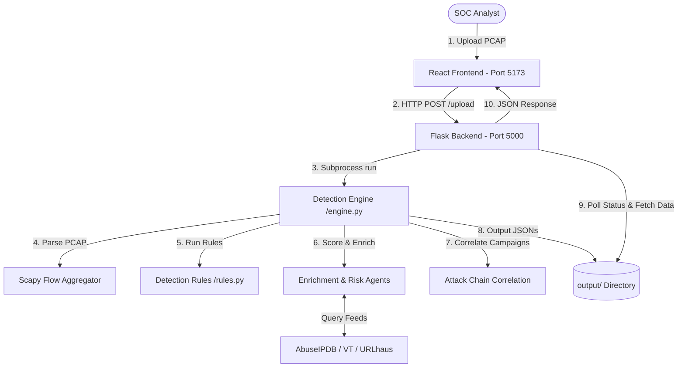

# 🔍 AutoSOC NDR - Network Detection & Response Platform

AutoSOC NDR is a professional-grade cybersecurity platform designed for deep network traffic analysis. By processing raw PCAP files, the platform aggregates thousands of packet-level alerts into high-context security events, enrichments threat indicators (IPs, Domains, URLs) using active OSINT threat feeds, and correlates events into chronological attack campaigns.

The project is structured with a modular **Python Flask Backend** (handling packet capture aggregation and agent-based analysis) and a modern **React (Vite) Frontend** (rendering a premium SOC Analyst Dashboard).

---

## 🚀 Key Features

*   **Pillar-Based Extraction**: Extracts all IP, Domain, and URL indicators from network flows.
*   **Smart Alert Aggregation**: Groups thousands of raw packet-level alerts into consolidated security events, reducing alert fatigue by up to 99.9%.
*   **Active OSINT Enrichment**: Automatically queries threat databases (AbuseIPDB, VirusTotal, URLhaus) to verify indicator reputation.
*   **Risk Scoring Agent**: Computes a detailed `0-100` risk score for alerts based on protocol anomalies, threat intelligence hits, and traffic volume.
*   **Attack Chain Correlation**: Groups isolated events into chronological campaign sequences (Reconnaissance → C2 → Impact) using connected-component logic.
*   **Analyst SOC Dashboard**: Real-time visualization of active campaigns, alert distributions, network protocols, top talkers, and a comprehensive chronological incident timeline.

---

## 📐 Platform Architecture



---

## 🛠 Project Structure

```text
Sem_2 project backup/
├── autosoc/                     # Flask Backend
│   ├── detection/               # Detection Engine & Rules
│   │   ├── engine.py            # CLI entry point for analysis
│   │   └── rules.py             # Logic for signatures and behavioral detection
│   ├── aggregation/             # Aggregation and campaign construction
│   ├── enrichment/              # OSINT lookup client (VirusTotal, AbuseIPDB)
│   ├── pcap/                    # Flow aggregation and PCAP parsing
│   ├── scoring/                 # Risk computation algorithms
│   ├── timeline/                # Event timeline generation
│   ├── uploads/                 # Storage for uploaded PCAPs
│   ├── output/                  # Cache & results folder for active analysis
│   ├── app.py                   # Flask server entry point
│   └── README.md                # Backend technical brief
├── autosoc-frontend/            # React Frontend
│   ├── src/
│   │   ├── components/          # Reusable UI components (Sidebar, Layout, Graph)
│   │   ├── pages/               # Views: Dashboard, Alerts, Campaigns, Timeline
│   │   ├── services/            # API client configurations (Axios/Zustand state)
│   │   └── index.css            # Tailored Tailwind/Vite CSS system
│   ├── package.json             # Frontend dependency configuration
│   └── vite.config.js           # Vite development server and proxy configs
└── output/                      # Global workspace output cache
```

---

## 🚦 Quick Start

### Prerequisites

*   **Python 3.10+** (tested up to Python 3.14)
*   **Node.js v18+** & **npm**
*   *Note: Wireshark/tshark configuration is optional as Scapy processes raw packet structures directly.*

---

### 1. Run Backend Server

1.  Navigate into the `autosoc` backend folder:
    ```bash
    cd autosoc
    ```
2.  Install dependencies (if not already installed in your Python environment):
    ```bash
    pip install flask flask-cors scapy requests
    ```
3.  Start the Flask backend:
    ```bash
    python app.py
    ```
    *The API server will launch at `http://localhost:5000`.*

---

### 2. Run Frontend Dashboard

1.  Navigate into the `autosoc-frontend` directory:
    ```bash
    cd ../autosoc-frontend
    ```
2.  Install frontend dependencies:
    ```bash
    npm install
    ```
3.  Start the Vite dev server:
    ```bash
    npm run dev
    ```
    *The React application will launch at `http://localhost:5173/`.*

---

## 🖥 Command Line Interface (CLI) Mode

You can run the detection engine directly from the command line without launching the web server.

1.  Open a terminal in the `autosoc/` directory.
2.  Run the engine pointing to a PCAP file:
    ```bash
    python detection/engine.py sample_data/lumma.pcap
    ```
3.  The engine will output packet counts, aggregated flows, detected alerts, and threat scoring logs directly to your stdout. JSON results will be written to `autosoc/output/alerts.json` and `autosoc/output/campaigns.json`.

---

## 🛡 Security Rules & Aggregation Logic

The backend supports several built-in threat detection rules:
*   **DDoS Reflection & Flood**: Scans for abnormal packets/sec rates originating from massive arrays of distinct IPs.
*   **C2 Beaconing**: Correlates recurring connection attempts to remote IPs on strict interval schedules.
*   **FTP / Telnet Credentials Cleartext**: Identifies credentials transmitted in plain-text over cleartext streams.
*   **Domain Reputation Anomalies**: Flags indicators communicating with known malicious command-and-control domains.
